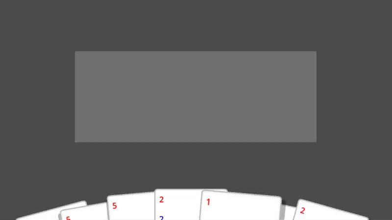

  

<h1 align="center">
  Godot Shaders
</h1>

  A collection of shaders for the Godot Engine.
  Published at: <a href="https://godotshaders.com/author/moai/">https://godotshaders.com/author/moai/</a>

## Showcase

### [Simple Shadow Shader for 2D Sprites](simple-shadow-shader-for-2d-sprites/simple-shadow-shader-for-2d-sprites.gdshader)

A very simple shader that adds a shadow effect to 2D sprites. This shader can be used to enhance depth and realism in 2D scenes.

### [Dynamic Shadow Shader for 2D Sprites](dynamic-shadow-shader-for-2d-sprites/dynamic-shadow-shader-for-2d-sprites.gdshader)

A dynamic shadow shader for 2D sprites. The shadow follows the light direction and adjusts its position based on the sprite's location and the screen center.

## License

This project is licensed under the MIT License. See the [LICENSE.md](LICENSE.md) file for more information.
